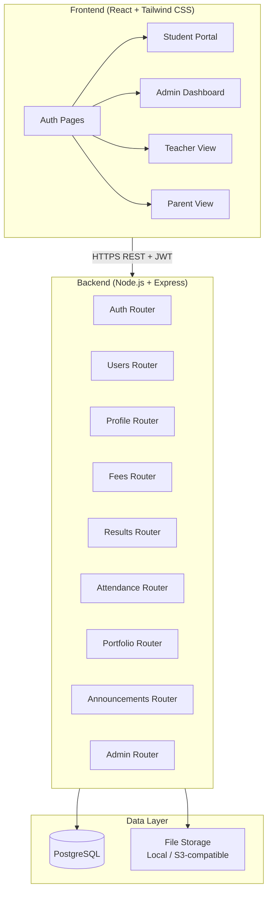

# Design Document: CompassionEdu School Management System

## Overview

CompassionEdu is a full-stack web application built on a React + Node.js/Express + PostgreSQL stack. It serves four user roles (Admin, Student, Teacher, Parent) through a single-page application frontend and a RESTful JSON API backend. The design prioritises modularity — each domain (fees, attendance, results, portfolio) is an independent backend module with its own routes, controllers, and service layer, making the system easy to extend.

The Ubuntu philosophy is reflected architecturally: every student record is a first-class entity with rich associated data (portfolio, timeline, media), not just a row in a table.

---

## Architecture



### Key Architectural Decisions

- **JWT Authentication**: Stateless tokens with role claims embedded. Tokens expire after 24 hours; refresh tokens are stored server-side for re-issuance.
- **Role-Based Middleware**: A single `requireRole(...roles)` Express middleware guards every protected route, keeping authorization logic centralised.
- **File Uploads**: Handled via `multer` middleware. Files are validated (type + size) before being written to storage. File metadata (URL, MIME type, size) is stored in PostgreSQL; binary data lives in the file system or an S3-compatible bucket.
- **Modular Backend**: Each domain is a self-contained Express Router module (`/src/routes/fees.js`, etc.) mounted on the main app. This allows independent development and testing.
- **React SPA with React Router**: Client-side routing with protected route wrappers that check JWT role claims before rendering pages.

---

## Components and Interfaces

### Backend Modules

#### Auth Module (`/api/auth`)
- `POST /api/auth/login` — accepts `{ email, password }`, returns `{ token, user }` 
- `POST /api/auth/refresh` — accepts refresh token, returns new access token
- `POST /api/auth/logout` — invalidates refresh token

#### Users Module (`/api/users`) — Admin only
- `GET /api/users` — list all users with pagination and search (`?q=`, `?role=`, `?page=`, `?limit=`)
- `POST /api/users` — create a new user
- `DELETE /api/users/:id` — soft-delete a user (sets `deleted_at`)

#### Profile Module (`/api/profile`)
- `GET /api/profile/:userId` — fetch profile data
- `PATCH /api/profile/:userId` — update school level, location, project count
- `POST /api/profile/:userId/photos` — upload a profile photo
- `PATCH /api/profile/:userId/photos/:photoId/default` — set default photo

#### Fees Module (`/api/fees`)
- `GET /api/fees/:studentId` — get fee records and payment history
- `POST /api/fees/:studentId/payments` — record a payment (Admin/Teacher)
- `GET /api/fees/summary` — aggregate summary for Admin dashboard

#### Results Module (`/api/results`)
- `GET /api/results/:studentId` — get results, filterable by `?term=`
- `POST /api/results` — create a result entry (Admin/Teacher)
- `GET /api/results/:studentId/report-card/:term` — generate PDF report card

#### Attendance Module (`/api/attendance`)
- `GET /api/attendance/:studentId` — get attendance records, filterable by `?month=`, `?subject=`
- `POST /api/attendance` — record attendance for a class session (Teacher)
- `GET /api/attendance/analytics` — aggregate analytics for Admin

#### Portfolio Module (`/api/portfolio`)
- `GET /api/portfolio/:studentId` — fetch full portfolio
- `POST /api/portfolio/:studentId/cv` — upload CV file
- `POST /api/portfolio/:studentId/experiences` — add experience entry
- `PUT /api/portfolio/:studentId/experiences/:id` — update experience entry
- `DELETE /api/portfolio/:studentId/experiences/:id` — remove experience entry
- `POST /api/portfolio/:studentId/media` — upload project media
- `PATCH /api/portfolio/:studentId/skills` — update skills list

#### Announcements Module (`/api/announcements`)
- `GET /api/announcements` — fetch announcements for the authenticated user's role
- `POST /api/announcements` — create announcement (Admin only)
- `PATCH /api/announcements/:id/read` — mark as read

#### Admin Module (`/api/admin`)
- `GET /api/admin/dashboard` — aggregate metrics for Compassion Dashboard
- `GET /api/admin/content` — list all Content_Items pending moderation
- `PATCH /api/admin/content/:id` — approve or flag a Content_Item

### Frontend Components

```
src/
  components/
    common/
      Navbar.jsx
      Sidebar.jsx
      ThemeToggle.jsx
      LoadingSpinner.jsx
      ErrorMessage.jsx
      ProtectedRoute.jsx
    profile/
      ProfileCard.jsx
      PhotoUploader.jsx
    fees/
      FeeStatusBadge.jsx
      PaymentHistoryTable.jsx
      FeeReminderBanner.jsx
    results/
      ResultsTable.jsx
      PerformanceTrendChart.jsx
      ReportCardDownload.jsx
    attendance/
      AttendanceCalendar.jsx
      AttendancePercentageBar.jsx
    portfolio/
      CVUploader.jsx
      ExperienceForm.jsx
      ProjectsGallery.jsx
      SkillsEditor.jsx
      GrowthTimeline.jsx
    admin/
      UserManagementTable.jsx
      ContentModerationPanel.jsx
      FeeCollectionChart.jsx
      AttendanceAnalyticsChart.jsx
      PerformanceOverviewChart.jsx
      CompassionDashboard.jsx
  pages/
    LoginPage.jsx
    StudentPortal.jsx
    AdminDashboard.jsx
    TeacherView.jsx
    ParentView.jsx
  hooks/
    useAuth.js
    useFees.js
    useAttendance.js
    useResults.js
    usePortfolio.js
  context/
    AuthContext.jsx
    ThemeContext.jsx
  utils/
    api.js          (Axios instance with JWT interceptor)
    validators.js
    formatters.js
```

---

## Data Models

### PostgreSQL Schema

```sql
-- Users and authentication
CREATE TABLE users (
  id            UUID PRIMARY KEY DEFAULT gen_random_uuid(),
  role          VARCHAR(20) NOT NULL CHECK (role IN ('admin','student','teacher','parent')),
  name          VARCHAR(255) NOT NULL,
  email         VARCHAR(255) UNIQUE NOT NULL,
  password_hash VARCHAR(255) NOT NULL,
  school_level  VARCHAR(100),
  location      VARCHAR(255),
  is_active     BOOLEAN DEFAULT TRUE,
  deleted_at    TIMESTAMPTZ,
  created_at    TIMESTAMPTZ DEFAULT NOW()
);

CREATE TABLE refresh_tokens (
  id         UUID PRIMARY KEY DEFAULT gen_random_uuid(),
  user_id    UUID REFERENCES users(id) ON DELETE CASCADE,
  token_hash VARCHAR(255) NOT NULL,
  expires_at TIMESTAMPTZ NOT NULL,
  created_at TIMESTAMPTZ DEFAULT NOW()
);

-- Profile photos
CREATE TABLE profile_photos (
  id         UUID PRIMARY KEY DEFAULT gen_random_uuid(),
  user_id    UUID REFERENCES users(id) ON DELETE CASCADE,
  url        TEXT NOT NULL,
  is_default BOOLEAN DEFAULT FALSE,
  created_at TIMESTAMPTZ DEFAULT NOW()
);

-- Student extended profile
CREATE TABLE student_profiles (
  user_id         UUID PRIMARY KEY REFERENCES users(id) ON DELETE CASCADE,
  cv_url          TEXT,
  project_numbers INT DEFAULT 0,
  skills          TEXT[] DEFAULT '{}',
  created_at      TIMESTAMPTZ DEFAULT NOW(),
  updated_at      TIMESTAMPTZ DEFAULT NOW()
);

-- Parent-student links
CREATE TABLE parent_student_links (
  parent_id  UUID REFERENCES users(id) ON DELETE CASCADE,
  student_id UUID REFERENCES users(id) ON DELETE CASCADE,
  PRIMARY KEY (parent_id, student_id)
);

-- Teacher-class assignments
CREATE TABLE teacher_class_assignments (
  teacher_id UUID REFERENCES users(id) ON DELETE CASCADE,
  class_name VARCHAR(100) NOT NULL,
  subject    VARCHAR(100),
  PRIMARY KEY (teacher_id, class_name, subject)
);

-- Fees
CREATE TABLE fees (
  id             UUID PRIMARY KEY DEFAULT gen_random_uuid(),
  student_id     UUID REFERENCES users(id) ON DELETE CASCADE,
  amount         NUMERIC(10,2) NOT NULL,
  due_date       DATE NOT NULL,
  status         VARCHAR(20) DEFAULT 'pending' CHECK (status IN ('paid','pending','overdue')),
  payment_plan   JSONB,
  created_at     TIMESTAMPTZ DEFAULT NOW()
);

CREATE TABLE fee_payments (
  id             UUID PRIMARY KEY DEFAULT gen_random_uuid(),
  fee_id         UUID REFERENCES fees(id) ON DELETE CASCADE,
  amount_paid    NUMERIC(10,2) NOT NULL,
  paid_at        TIMESTAMPTZ DEFAULT NOW(),
  transaction_id VARCHAR(255),
  receipt_ref    VARCHAR(255)
);

-- Examination results
CREATE TABLE results (
  id         UUID PRIMARY KEY DEFAULT gen_random_uuid(),
  student_id UUID REFERENCES users(id) ON DELETE CASCADE,
  subject    VARCHAR(100) NOT NULL,
  marks      NUMERIC(5,2) NOT NULL CHECK (marks >= 0 AND marks <= 100),
  grade      VARCHAR(5),
  term       VARCHAR(50) NOT NULL,
  created_at TIMESTAMPTZ DEFAULT NOW()
);

-- Attendance
CREATE TABLE attendance (
  id         UUID PRIMARY KEY DEFAULT gen_random_uuid(),
  student_id UUID REFERENCES users(id) ON DELETE CASCADE,
  date       DATE NOT NULL,
  subject    VARCHAR(100),
  period     VARCHAR(50),
  status     VARCHAR(20) NOT NULL CHECK (status IN ('present','absent','late')),
  created_at TIMESTAMPTZ DEFAULT NOW()
);

-- Portfolio experiences
CREATE TABLE experiences (
  id          UUID PRIMARY KEY DEFAULT gen_random_uuid(),
  student_id  UUID REFERENCES users(id) ON DELETE CASCADE,
  title       VARCHAR(255) NOT NULL,
  organization VARCHAR(255),
  start_date  DATE NOT NULL,
  end_date    DATE,
  description TEXT,
  created_at  TIMESTAMPTZ DEFAULT NOW()
);

-- Portfolio media (projects gallery)
CREATE TABLE portfolio_media (
  id           UUID PRIMARY KEY DEFAULT gen_random_uuid(),
  student_id   UUID REFERENCES users(id) ON DELETE CASCADE,
  url          TEXT NOT NULL,
  mime_type    VARCHAR(100) NOT NULL,
  title        VARCHAR(255),
  description  TEXT,
  moderation_status VARCHAR(20) DEFAULT 'pending' CHECK (moderation_status IN ('pending','approved','flagged')),
  created_at   TIMESTAMPTZ DEFAULT NOW()
);

-- Announcements
CREATE TABLE announcements (
  id          UUID PRIMARY KEY DEFAULT gen_random_uuid(),
  title       VARCHAR(255) NOT NULL,
  content     TEXT NOT NULL,
  target_role VARCHAR(20) NOT NULL CHECK (target_role IN ('all','student','teacher','parent')),
  created_by  UUID REFERENCES users(id),
  created_at  TIMESTAMPTZ DEFAULT NOW()
);

CREATE TABLE announcement_reads (
  announcement_id UUID REFERENCES announcements(id) ON DELETE CASCADE,
  user_id         UUID REFERENCES users(id) ON DELETE CASCADE,
  read_at         TIMESTAMPTZ DEFAULT NOW(),
  PRIMARY KEY (announcement_id, user_id)
);
```

### TypeScript / API Types (shared)

```typescript
type Role = 'admin' | 'student' | 'teacher' | 'parent';
type FeeStatus = 'paid' | 'pending' | 'overdue';
type AttendanceStatus = 'present' | 'absent' | 'late';
type ModerationStatus = 'pending' | 'approved' | 'flagged';

interface JWTPayload {
  sub: string;       // user id
  role: Role;
  iat: number;
  exp: number;
}

interface FeeRecord {
  id: string;
  studentId: string;
  amount: number;
  dueDate: string;   // ISO date
  status: FeeStatus;
  paymentPlan?: PaymentPlan;
  payments: FeePayment[];
}

interface AttendanceRecord {
  id: string;
  studentId: string;
  date: string;      // ISO date
  subject?: string;
  period?: string;
  status: AttendanceStatus;
}

interface Result {
  id: string;
  studentId: string;
  subject: string;
  marks: number;     // 0–100
  grade: string;
  term: string;
}

interface ExperienceEntry {
  id: string;
  studentId: string;
  title: string;
  organization?: string;
  startDate: string;
  endDate?: string;
  description?: string;
}
```

---

## Correctness Properties

*A property is a characteristic or behavior that should hold true across all valid executions of a system — essentially, a formal statement about what the system should do. Properties serve as the bridge between human-readable specifications and machine-verifiable correctness guarantees.*

### Property 1: Role access isolation

*For any* authenticated request, the set of resources accessible to a user with role R must be a strict subset of the resources accessible to Admin, and must not overlap with resources exclusively owned by a different non-Admin user.

**Validates: Requirements 1.4, 1.5, 1.6, 1.7, 1.8**

---

### Property 2: Password never stored in plaintext

*For any* user creation or password update operation, the value stored in `users.password_hash` must not equal the plaintext password submitted in the request.

**Validates: Requirements 1.9**

---

### Property 3: User search result relevance

*For any* search query string Q submitted to the user management table, every returned user record must have a name or email that contains Q as a substring (case-insensitive).

**Validates: Requirements 2.4**

---

### Property 4: Fee status transition correctness

*For any* fee record, if the current date is past `due_date` and no payment covering the full amount exists, the fee status must be `overdue`. If a payment fully covering the amount exists, the status must be `paid`. Otherwise the status must be `pending`.

**Validates: Requirements 4.1, 4.3**

---

### Property 5: Examination marks range invariant

*For any* result record stored in the system, the `marks` field must satisfy `0 ≤ marks ≤ 100`.

**Validates: Requirements 5.6**

---

### Property 6: Attendance percentage calculation correctness

*For any* student and any subject, the attendance percentage reported by the system must equal `(count of 'present' records / total records) × 100`, rounded to two decimal places.

**Validates: Requirements 6.2**

---

### Property 7: Portfolio media moderation state machine

*For any* Content_Item, after an Admin flags it, the item's `moderation_status` must be `flagged` and the item must not appear in the student's public portfolio view. After an Admin approves it, the status must be `approved` and the item must appear in the portfolio view.

**Validates: Requirements 8.6, 8.7**

---

### Property 8: Announcement targeting correctness

*For any* announcement with target role T, every user whose role matches T (or T = 'all') must receive the announcement, and no user whose role does not match T must receive it.

**Validates: Requirements 9.1, 9.4**

---

### Property 9: File upload rejection for invalid types and sizes

*For any* profile photo upload with a MIME type not in {image/jpeg, image/png, image/webp} or with a file size > 10MB, the System must reject the upload with an error response and must not persist the file.

*For any* CV upload with a MIME type not in {application/pdf, application/vnd.openxmlformats-officedocument.wordprocessingml.document} or with a file size > 50MB, the System must reject the upload with an error response and must not persist the file.

**Validates: Requirements 3.6, 7.6, 7.7**

---

### Property 10: Duplicate email rejection

*For any* user creation request where the submitted email already exists in the `users` table (case-insensitive), the System must reject the request and must not create a duplicate user record.

**Validates: Requirements 2.5**

---

## Error Handling

| Scenario | HTTP Status | Response Shape |
|---|---|---|
| Invalid credentials | 401 | `{ error: "Invalid email or password" }` |
| Expired/missing JWT | 401 | `{ error: "Authentication required" }` |
| Insufficient role | 403 | `{ error: "Access denied" }` |
| Resource not found | 404 | `{ error: "Resource not found" }` |
| Duplicate email | 409 | `{ error: "Email already in use" }` |
| Invalid file type/size | 422 | `{ error: "...", field: "file" }` |
| Marks out of range | 422 | `{ error: "Marks must be between 0 and 100" }` |
| Internal server error | 500 | `{ error: "An unexpected error occurred" }` |

All error responses follow the shape `{ error: string, field?: string }`. The frontend maps these to user-facing messages using a centralised error formatter in `utils/formatters.js`.

Unhandled promise rejections and uncaught exceptions are caught by a global Express error handler that logs the stack trace server-side and returns a generic 500 to the client.

---

## Testing Strategy

### Dual Testing Approach

Both unit tests and property-based tests are required. They are complementary:
- Unit tests catch concrete bugs in specific scenarios and edge cases.
- Property-based tests verify universal correctness across a wide range of generated inputs.

### Unit Testing

- Framework: **Jest** (backend) + **React Testing Library** (frontend)
- Coverage targets: all service-layer functions, all validation utilities, all React components with user interaction
- Focus areas:
  - Authentication flow (login success, login failure, token expiry)
  - Fee status transitions (pending → overdue, pending → paid)
  - Attendance percentage calculation edge cases (0 records, 100% present, 0% present)
  - File upload validation (boundary sizes, boundary MIME types)
  - Role-based route protection (each role attempting each protected route)

### Property-Based Testing

- Framework: **fast-check** (works with Jest for both Node.js and browser environments)
- Minimum **100 iterations** per property test
- Each property test must be tagged with a comment referencing the design property:
  - Tag format: `// Feature: compassion-edu, Property N: <property_text>`

| Property | Test Description | fast-check Arbitraries |
|---|---|---|
| Property 1 | Role access isolation | `fc.constantFrom('student','teacher','parent')`, random resource IDs |
| Property 2 | Password not stored plaintext | `fc.string()` for passwords |
| Property 3 | User search relevance | `fc.string()` for query, `fc.array(fc.record({name, email}))` for user list |
| Property 4 | Fee status transitions | `fc.date()` for due dates, `fc.float()` for amounts |
| Property 5 | Marks range invariant | `fc.float({min: 0, max: 100})` for valid marks, `fc.float()` for invalid |
| Property 6 | Attendance percentage | `fc.array(fc.constantFrom('present','absent','late'))` |
| Property 7 | Moderation state machine | `fc.constantFrom('pending','approved','flagged')` transitions |
| Property 8 | Announcement targeting | `fc.constantFrom('all','student','teacher','parent')` for target role |
| Property 9 | File upload rejection | `fc.string()` for MIME types, `fc.integer()` for file sizes |
| Property 10 | Duplicate email rejection | `fc.emailAddress()` for emails |
