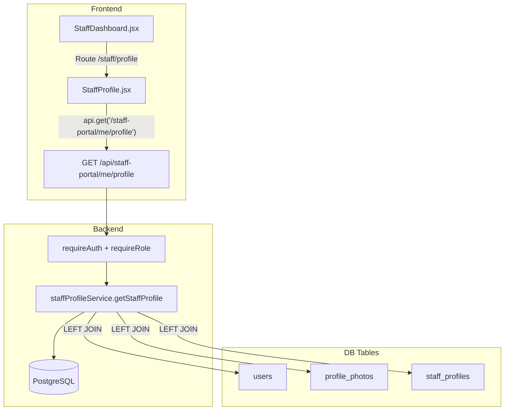

# Design Document — Staff Profile Module

## Overview

The Staff Profile Module adds a secure, read-only profile page to the CompassionEdu Staff Dashboard. The feature is composed of three layers:

1. **Database** — a new `staff_profiles` table holding staff-specific extended fields (bio, portfolio URL, CV URL, age, gender, phone, department).
2. **Backend** — a new `staffProfileService.js` and a new `GET /api/staff-portal/me/profile` endpoint on the already-mounted `/api/staff-portal` router.
3. **Frontend** — a new `StaffProfile.jsx` page component rendered inside the existing dark-theme Staff Dashboard shell, reachable at `/staff/profile`.

The design is intentionally additive. No existing tables, services, or routes are modified beyond the two targeted files (`staffPortal.js` and `StaffDashboard.jsx`). All new behaviour is behind the existing `requireAuth + requireRole('staff','admin')` middleware already applied at the router level.

---

## Architecture



**Request flow:**

1. The React frontend calls `api.get('/staff-portal/me/profile')` with the stored JWT.
2. `requireAuth` verifies the token and attaches `{ sub, role }` to `req.user`.
3. `requireRole('staff','admin')` gates the route; all other roles receive HTTP 403.
4. The route handler extracts `req.user.sub` and passes it to `staffProfileService.getStaffProfile(userId)`.
5. The service executes a single parameterised query joining `users`, `profile_photos`, and `staff_profiles`.
6. The assembled profile object is returned as JSON.
7. `StaffProfile.jsx` renders the response in labelled sections inside the existing `<Navbar>` + `<Sidebar>` shell.

The `staffPortal.js` router also registers a catch-all `router.all('/me/profile', ...)` handler **after** the GET handler to return HTTP 405 for any mutating method.

---

## Components and Interfaces

### Backend

#### `staffProfileService.js`

```
getStaffProfile(userId: string): Promise<ProfileData>
```

- Accepts exactly one argument — the `userId` UUID (sourced exclusively from `req.user.sub` by the caller).
- Executes a single parameterised SQL query (see Data Models section).
- Throws `{ message: 'Resource not found', status: 404 }` when the users row is absent or soft-deleted.
- Wraps the `LEFT JOIN` on `staff_profiles` in a try/catch so that a missing table degrades to `null` values for extended fields rather than a 500.
- Returns a plain object matching the `ProfileData` shape below.

The service exports **only** `getStaffProfile`. No write, update, or delete functions are exposed.

#### Route additions in `staffPortal.js`

```
GET  /api/staff-portal/me/profile  → staffProfileService.getStaffProfile(req.user.sub)
*    /api/staff-portal/me/profile  → 405 Method Not Allowed
```

The `router.all` catch-all is placed **after** the `router.get` handler so Express' routing order ensures GET requests are handled correctly.

#### Middleware (unchanged, applied at router level)

| Middleware | Behaviour |
|---|---|
| `requireAuth` | Verifies JWT; attaches `req.user = { sub, role }`; 401 on failure |
| `requireRole('staff','admin')` | Allows only staff and admin; 403 for all other roles |

### Frontend

#### `StaffProfile.jsx` (new)

A self-contained page component. Responsibilities:
- On mount, call `api.get('/staff-portal/me/profile')` and store the result in local state.
- Render a loading spinner while the request is in-flight.
- Render a user-readable error message on API failure.
- Render the profile in five glass-card sections: Personal Information, Employment Information, Documents (CV), Portfolio, and Bio / About Me.
- Apply the dark-theme glass-card styles matching `StaffDashboard.jsx`.
- Use `hover:scale-[1.02]` on interactive elements.
- Never render any edit, delete, upload, or mutation control.

#### `StaffDashboard.jsx` (modified)

Two targeted additions:
1. Add `{ to: '/staff/profile', label: 'My Profile', icon: '👤' }` to the `LINKS` array.
2. Add `<Route path="profile" element={<StaffProfile />} />` inside the `<Routes>` block.
3. Import `StaffProfile` at the top of the file.

---

## Data Models

### New table: `staff_profiles`

```sql
CREATE TABLE IF NOT EXISTS staff_profiles (
  user_id       UUID PRIMARY KEY REFERENCES users(id) ON DELETE CASCADE,
  bio           TEXT,
  portfolio_url TEXT,
  cv_url        TEXT,
  age           INT,
  gender        VARCHAR(20),
  phone         VARCHAR(50),
  department    VARCHAR(255),
  created_at    TIMESTAMPTZ DEFAULT NOW(),
  updated_at    TIMESTAMPTZ DEFAULT NOW()
);
```

This DDL is appended to `backend/src/db/schema.sql` using `CREATE TABLE IF NOT EXISTS`, consistent with all other tables in the schema file. The `staff_role` field is already on `users.staff_role`; base fields `name` and `email` are on `users`.

### Service query

```sql
SELECT
  u.id,
  u.name,
  u.email,
  u.staff_role,
  u.created_at,
  sp.phone,
  sp.age,
  sp.gender,
  sp.department,
  sp.bio,
  sp.portfolio_url,
  sp.cv_url,
  pp.url AS photo_url
FROM users u
LEFT JOIN staff_profiles sp ON sp.user_id = u.id
LEFT JOIN profile_photos pp ON pp.user_id = u.id AND pp.is_default = TRUE
WHERE u.id = $1
  AND u.deleted_at IS NULL
```

Using a single query with two `LEFT JOIN`s means the row is still returned even when no `staff_profiles` row exists (all `sp.*` columns will be `NULL`) and even when no default photo exists (`photo_url` will be `NULL`).

### `ProfileData` shape (API response)

```json
{
  "id":            "uuid",
  "name":          "string",
  "email":         "string",
  "phone":         "string | null",
  "age":           "number | null",
  "gender":        "string | null",
  "staff_role":    "string | null",
  "department":    "string | null",
  "created_at":    "ISO 8601 timestamp",
  "photo_url":     "string | null",
  "cv_url":        "string | null",
  "portfolio_url": "string | null",
  "bio":           "string | null"
}
```

All 13 fields are always present in the response. Optional fields carry `null` when not populated.

### Avatar fallback (frontend)

When `photo_url` is `null` or empty, `StaffProfile.jsx` constructs:

```
https://ui-avatars.com/api/?name={encodeURIComponent(name)}&background=f97316&color=fff
```

This matches the pattern used elsewhere in the project.

### Date formatting (frontend)

```js
new Date(created_at).toLocaleDateString('en-GB', {
  day: 'numeric', month: 'long', year: 'numeric'
})
// → "15 January 2023"
```

---

## Correctness Properties

*A property is a characteristic or behavior that should hold true across all valid executions of a system — essentially, a formal statement about what the system should do. Properties serve as the bridge between human-readable specifications and machine-verifiable correctness guarantees.*

### Property 1: Ownership Invariant

*For any* valid user UUID passed to `getStaffProfile(userId)`, the returned profile object's `id` field SHALL equal `userId`.

This subsumes the cross-profile isolation requirement: because the service accepts only `userId` as input and binds it to `WHERE u.id = $1`, it is structurally impossible to return a different user's data.

**Validates: Requirements 1.1, 1.6, 3.1, 3.2, 3.3**

---

### Property 2: Field Completeness

*For any* valid staff user in the database, `getStaffProfile(userId)` SHALL return an object that contains all 13 required keys — `id`, `name`, `email`, `phone`, `age`, `gender`, `staff_role`, `department`, `created_at`, `photo_url`, `cv_url`, `portfolio_url`, `bio` — with `null` as a permitted value for every optional field.

**Validates: Requirements 1.2, 10.1, 10.4**

---

### Property 3: 404 for Missing User

*For any* UUID that does not correspond to an active (non-deleted) row in `users`, `getStaffProfile(userId)` SHALL throw an error with `status === 404`.

**Validates: Requirements 1.5**

---

### Property 4: HTTP 405 for Mutation Methods

*For any* HTTP method in `{ POST, PUT, PATCH, DELETE }` sent to `/api/staff-portal/me/profile` by an authenticated staff member, the API SHALL respond with HTTP 405 Method Not Allowed.

**Validates: Requirements 2.2**

---

### Property 5: Graceful Degradation Without staff_profiles Row

*For any* user whose `users` row exists but who has no corresponding `staff_profiles` row, `getStaffProfile(userId)` SHALL return a valid profile object containing the correct `id`, `name`, `email`, and `staff_role` from `users`, with `phone`, `age`, `gender`, `department`, `bio`, `portfolio_url`, and `cv_url` all equal to `null`.

**Validates: Requirements 10.2, 10.3**

---

### Property 6: Nullable Field Display

*For any* profile response object, the `StaffProfile` component SHALL display a `"—"` placeholder for every optional field (`phone`, `age`, `gender`, `staff_role`, `department`) whose value is `null` or empty; display `"No CV on file"` when `cv_url` is null/empty; display `"No portfolio link on file"` when `portfolio_url` is null/empty; and display `"No bio provided."` when `bio` is null/empty. Conversely, when any of these fields is non-null and non-empty, the component SHALL display the actual value and hide the placeholder.

**Validates: Requirements 4.3, 6.4, 7.2, 8.1, 8.2**

---

### Property 7: Date Formatting

*For any* valid ISO 8601 timestamp stored in `created_at`, the formatted date string produced by `StaffProfile` SHALL match the pattern `"D Month YYYY"` (e.g. `"15 January 2023"`) as produced by `toLocaleDateString('en-GB', { day: 'numeric', month: 'long', year: 'numeric' })`.

**Validates: Requirements 5.2**

---

## Error Handling

| Scenario | Layer | Response |
|---|---|---|
| Missing or invalid JWT | `requireAuth` middleware | HTTP 401 `{ "error": "Authentication required" }` |
| Role not `staff` or `admin` | `requireRole` middleware | HTTP 403 `{ "error": "Access denied" }` |
| Mutating method on `/me/profile` | `router.all` catch-all | HTTP 405 `{ "error": "Method not allowed" }` |
| User UUID not found / soft-deleted | `staffProfileService` | Throws `{ message: 'Resource not found', status: 404 }` → HTTP 404 |
| `staff_profiles` table missing | `staffProfileService` catch block | Returns base `users` row with `null` extended fields — no error thrown |
| Unexpected DB error | Express global error handler | HTTP 500 `{ "error": "An unexpected error occurred" }` |
| API error in frontend | `StaffProfile.jsx` catch block | Renders user-readable error message; does not throw unhandled exception |

### Service error pattern (matches existing `profileService.js`)

```js
async function getStaffProfile(userId) {
  const { rows } = await pool.query(SQL, [userId]);
  if (rows.length === 0) {
    const err = new Error('Resource not found');
    err.status = 404;
    throw err;
  }
  return rows[0];
}
```

The global error handler in `app.js` reads `err.status` to set the response code, consistent with all other service errors in the project.

### `staff_profiles` table degradation

The service wraps the joined query and catches any error whose message contains `"staff_profiles"` (table-not-found), then falls back to a simpler query on `users` + `profile_photos` only, returning `null` for all `staff_profiles` columns.

---

## Testing Strategy

### PBT library

This project uses **fast-check** (already a dependency, used in `profileService.pbt.test.js`, `adminService.pbt.test.js`, etc.). Property-based tests for this module go in `backend/src/services/staffProfileService.pbt.test.js`.

### Dual Testing Approach

**Unit / example-based tests** (`staffProfileService.test.js`):
- Successful profile fetch returns correct shape.
- 404 thrown when pool returns no rows.
- `photo_url` is `null` when no default photo exists.
- `staff_profiles` table absence degrades gracefully (null extended fields).
- Route handler returns 405 for each mutating method (example-based, four cases).

**Property-based tests** (`staffProfileService.pbt.test.js`):

Each property test mocks `pool.query` and runs a minimum of **100 iterations** per `fc.assert` call, consistent with all other PBT files in the project.

| Property | Tag |
|---|---|
| P1: Ownership Invariant | `Feature: staff-profile-module, Property 1: getStaffProfile(userId) always returns result.id === userId` |
| P2: Field Completeness | `Feature: staff-profile-module, Property 2: response always contains all 13 required keys` |
| P3: 404 for Missing User | `Feature: staff-profile-module, Property 3: getStaffProfile throws status 404 for any missing userId` |
| P4: HTTP 405 for Mutation Methods | `Feature: staff-profile-module, Property 4: POST/PUT/PATCH/DELETE to /me/profile always returns 405` |
| P5: Graceful Degradation | `Feature: staff-profile-module, Property 5: missing staff_profiles row returns base user data with null extended fields` |
| P6: Nullable Field Display | `Feature: staff-profile-module, Property 6: null optional fields render placeholder; non-null fields render value` |
| P7: Date Formatting | `Feature: staff-profile-module, Property 7: any ISO timestamp formats to D Month YYYY` |

**Frontend tests** (React Testing Library, unit):
- `StaffProfile.jsx` renders personal info section with all fields.
- Null `photo_url` renders ui-avatars fallback URL.
- Null optional fields render `"—"` placeholder.
- Non-null `cv_url` renders View CV and Download CV buttons; null renders "No CV on file".
- Non-null `portfolio_url` renders Open Portfolio button; null renders "No portfolio link on file".
- Non-null `bio` renders bio text; null renders "No bio provided."
- Loading state renders spinner.
- API error renders error message, not a blank screen.
- No edit, delete, upload, or mutation controls are present in the rendered output.

**Integration smoke tests**:
- `GET /api/staff-portal/me/profile` with a valid staff JWT returns HTTP 200 and the correct profile shape.
- `GET /api/staff-portal/me/profile` with no JWT returns HTTP 401.
- `GET /api/staff-portal/me/profile` with an admin JWT returns HTTP 200 (admin role is allowed).
- `POST /api/staff-portal/me/profile` with a valid staff JWT returns HTTP 405.
- `GET /api/staff-portal/me/profile` with a student JWT returns HTTP 403.
